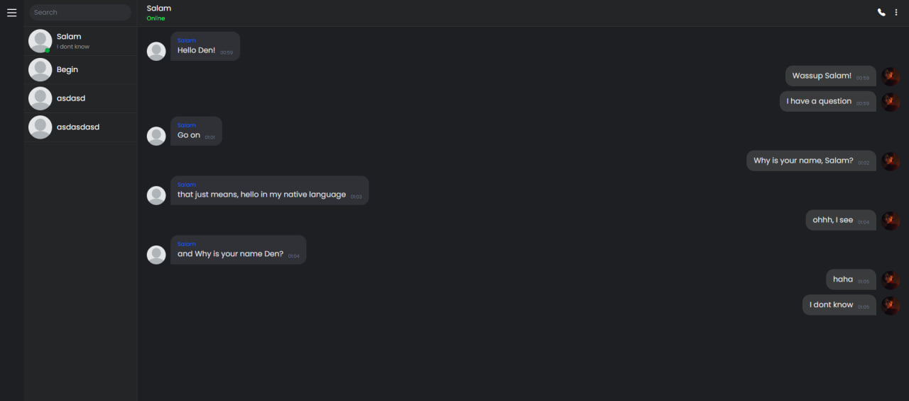
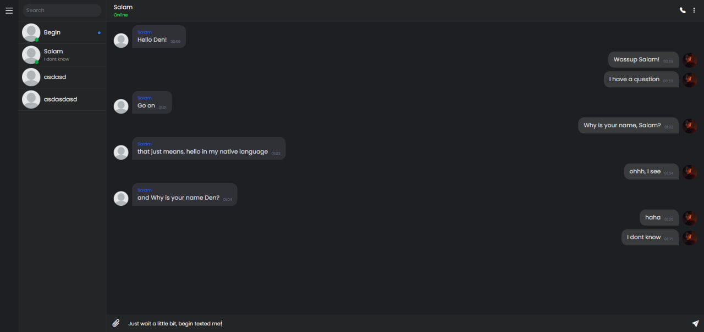
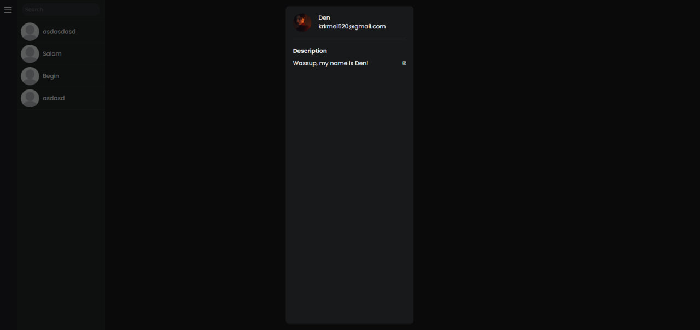

Chat application.

🗨️ Core Chat Features

- Real-time messaging via WebSockets (socket.io)
- Instant decryption on the client — no server access to message content
- Image sharing with AWS S3 integration

👥 User & Chat Management
- Live user list updates using WebSocket events
- Automatic chat ordering based on the last sent/received message

🎨 Frontend & UX
- Built with React + TypeScript
- Zustand for global state management
- TanStack Query for server state synchronization
- React Router v6+ for clean routing
- TailwindCSS for modern UI

🗄️ Backend & Infrastructure
- Node.js + Express server
- MongoDB for persistent storage
- AWS S3 for image uploads

